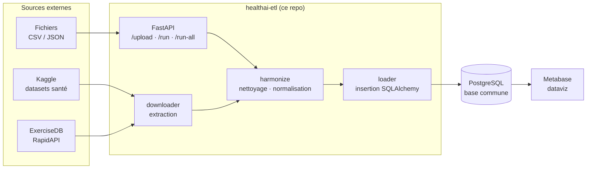

<div align="center">

# HealthAI ETL

**Pipeline de données de l'écosystème HealthAI Coach** — extraction des sources externes, harmonisation et chargement dans PostgreSQL.

[](https://github.com/HealthAI-Corpo/healthai-etl/actions/workflows/ci.yml)
[](https://www.python.org)
[](https://fastapi.tiangolo.com)
[](https://www.sqlalchemy.org)
[](https://docs.astral.sh/uv/)
[](https://www.conventionalcommits.org)

[Architecture](#architecture) · [Démarrage rapide](#démarrage-rapide) · [API](#api) · [Authentification](#authentification) · [Automatisation](#automatisation-cron)

</div>

---

## Sommaire

- [Architecture](#architecture)
- [Stack technique](#stack-technique)
- [Démarrage rapide](#démarrage-rapide)
- [Variables d'environnement](#variables-denvironnement)
- [API](#api)
- [Authentification](#authentification)
- [Automatisation (cron)](#automatisation-cron)
- [Qualité & tests](#qualité--tests)
- [Structure du projet](#structure-du-projet)

---

## Architecture



Chaque pipeline suit le même cycle **extract → transform → load** : les données brutes atterrissent dans `data/raw`, sont harmonisées (types, doublons, valeurs aberrantes) puis chargées dans la base PostgreSQL partagée avec [healthai-api](https://github.com/HealthAI-Corpo/healthai-api).

---

## Stack technique

| Couche | Technologie |
|---|---|
| Langage | Python 3.12+ |
| Paquets | [uv](https://docs.astral.sh/uv/) |
| API | FastAPI · Uvicorn |
| ORM | SQLAlchemy 2.0 |
| Migrations | Alembic |
| Identité | Zitadel — JWT RS256 (JWKS) · M2M JWT Profile |
| Dataviz | Metabase (docker-compose) |
| Qualité | Ruff (lint + format) · pytest |
| Conteneurs | Docker · docker-compose |

---

## Démarrage rapide

### Prérequis

- [uv](https://docs.astral.sh/uv/getting-started/installation/) installé
- Docker (pour la base de données)

### Installation

```bash
# 1. Dépendances
uv sync

# 2. Configuration
cp .env.example .env        # puis éditer les valeurs

# 3. Base de données (Docker)
docker-compose up -d db

# 4. Migrations
uv run alembic upgrade head

# 5. Serveur FastAPI
uv run uvicorn src.server:app --reload
# → http://127.0.0.1:8000/docs  (Swagger UI)
```

### Infrastructure complète (app + BDD + Metabase)

```bash
docker-compose up -d --build
```

### Exécuter le pipeline manuellement

```bash
uv run python src/main.py                                    # pipeline complet
uv run python src/data_pipeline/downloader/api_client.py     # téléchargements seuls
```

---

## Variables d'environnement

| Variable | Requis | Description |
|---|:---:|---|
| `DATABASE_URL` | ✅ | Connexion PostgreSQL (SQLAlchemy) |
| `ZITADEL_ISSUER` | ✅ | URL de l'instance Zitadel (sans slash final) |
| `JWT_AUDIENCE` | ✅ | **Project ID** du projet Zitadel — même valeur que côté healthai-api |
| `USERNAME` / `APIKEY` | ✅ | Credentials [Kaggle](https://www.kaggle.com/settings) (section API) |
| `EXERCISE_DB_API_KEY` | ✅ | Clé [RapidAPI](https://rapidapi.com/hub) pour ExerciseDB |
| `ZITADEL_PROJECT_ID` | M2M | Project ID (scope d'audience du token machine) |
| `ZITADEL_M2M_KEY_FILE` | M2M | Chemin de la clé machine JSON (jamais commitée — `secrets/` est ignoré) |
| `LOG_LEVEL` / `LOG_DIR` / … | — | Configuration Loguru (voir `.env.example`) |

Modèle complet : [`.env.example`](.env.example).

---

## API

Documentation interactive sur **`/docs`** (Swagger UI).

| Endpoint | Méthode | Accès | Description |
|---|---|---|---|
| `/health` | GET | Public | Statut du service |
| `/upload/{pipeline}` | POST | **admin** | Upload d'un CSV/JSON puis traitement |
| `/run/{pipeline}` | POST | **admin** | Exécute un pipeline précis |
| `/run-all` | POST | **admin** | Exécute tous les pipelines |
| `/run-download` | POST | **admin** | Télécharge les sources externes |

Pipelines disponibles : `exercices` · `aliments` · `recommendations` · `historique_seance` · `historique_seance_synthetic`

---

## Authentification

Tous les endpoints pipeline exigent un JWT Zitadel valide **portant le rôle `admin`** — seul `/health` est public.

```
Requête entrante
  ↓ Validation JWT     signature RS256 (JWKS) · issuer · audience
  ↓ Vérification rôle  claim du token, ou userinfo pour les tokens M2M
  ↓ Endpoint           202 — sinon 401 (token) / 403 (rôle)
```

| Appelant | Flux | Rôles lus depuis |
|---|---|---|
| Humain (dashboard admin) | OIDC via le front Next.js | le token directement |
| Machine (cron, CI, scripts) | **JWT Profile** (clé machine) | le userinfo Zitadel¹ |

> ¹ Zitadel n'asserte pas les rôles dans l'access token des service users — `require_admin` interroge automatiquement le userinfo avec le même token.

### Configurer le M2M dans Zitadel

1. **Users → New → Service User** — nom : `etl-service`, Access Token Type : **JWT**
2. Fiche du service user → **Keys → New** → **Download** le fichier JSON
   (clé privée, affichée une seule fois — à stocker dans `./secrets/`, hors git)
3. Projet **Frontend** → **Role Assignments** → assigner le rôle **`admin`** au service user

### Obtenir un token M2M

Le client [`src/auth/m2m.py`](src/auth/m2m.py) signe une assertion JWT avec la clé privée du fichier JSON (flux *JWT Profile*) et l'échange contre un access token — mis en cache jusqu'à expiration.

```bash
# CLI (pratique pour un cron)
TOKEN=$(uv run python -m src.auth.m2m)
curl -X POST https://etl.example.com/run-all -H "Authorization: Bearer $TOKEN"
```

```python
# Python
from src.auth.m2m import get_m2m_token
token = get_m2m_token()
```

Le token est demandé avec deux scopes indispensables :

| Scope | Rôle | Sans lui |
|---|---|---|
| `urn:zitadel:iam:org:project:id:<PROJECT_ID>:aud` | Audience du projet dans le token | 401 |
| `urn:zitadel:iam:org:projects:roles` | Assertion des rôles | 403 |

---

## Automatisation (cron)

Les scripts `cron_kaggle.sh` (Unix) et `cron_kaggle.bat` (Windows) lancent l'ingestion Kaggle **dans le conteneur Docker existant** — aucun environnement Python requis sur l'hôte.

**Linux / macOS** — ajouter au crontab :

```cron
0 3 * * * /chemin/vers/healthai-etl/cron_kaggle.sh
```

**Windows** — Planificateur de tâches :
- Action : *Démarrer un programme* → `cron_kaggle.bat`
- ⚠️ « Démarrer dans » : le chemin racine du projet

---

## Qualité & tests

```bash
uv run ruff check            # lint
uv run ruff format           # formatage
uv run pytest                # tests (auth, M2M, pipelines, validation)
```

La CI (GitHub Actions) exécute ruff + pytest sur chaque PR — le status check `CI` est requis pour merger. Les PRs vers `main` doivent provenir de `develop` (`check-source-branch`).

---

## Structure du projet

```
├── alembic/                  # Migrations du schéma (versionnées)
├── data/                     # Données locales (raw / clean)
├── notebooks/                # Analyse exploratoire (kernel Python 3.13)
├── secrets/                  # Clés machine Zitadel (gitignoré)
├── src/
│   ├── auth/
│   │   ├── dependencies.py   # require_auth · require_admin (FastAPI)
│   │   ├── jwks.py           # Cache des clés publiques Zitadel
│   │   └── m2m.py            # Client M2M JWT Profile (+ CLI)
│   ├── data_pipeline/
│   │   ├── downloader/       # Extraction (Kaggle, RapidAPI)
│   │   ├── harmonize/        # Nettoyage et transformation
│   │   ├── loader/           # Insertion en base
│   │   ├── database.py       # Connexion SQLAlchemy
│   │   └── models.py         # Modèles ORM
│   ├── main.py               # Point d'entrée du pipeline complet
│   └── server.py             # API FastAPI
├── tests/                    # pytest (78 tests)
├── cron_kaggle.{sh,bat}      # Ingestion planifiée via Docker
└── docker-compose.yml        # App + PostgreSQL + Metabase
```

---

<div align="center">
<sub>HealthAI Coach — projet MSPR · <a href="https://github.com/HealthAI-Corpo">HealthAI-Corpo</a></sub>
</div>
